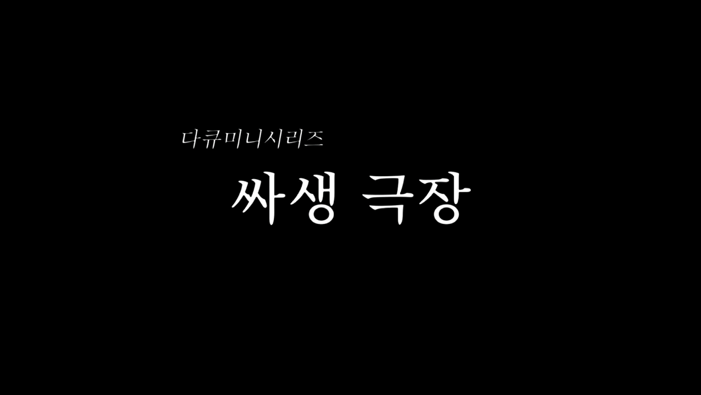
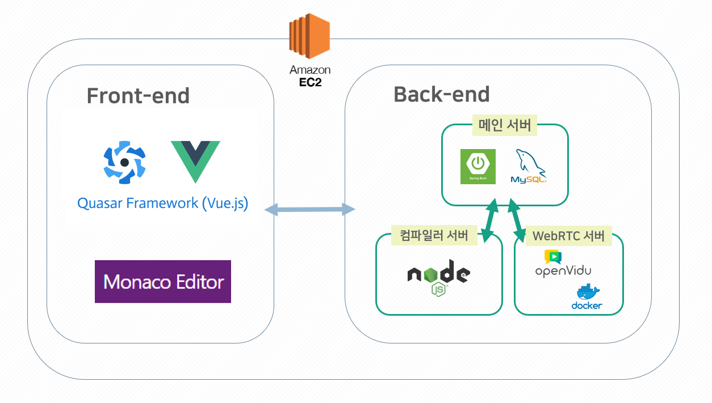
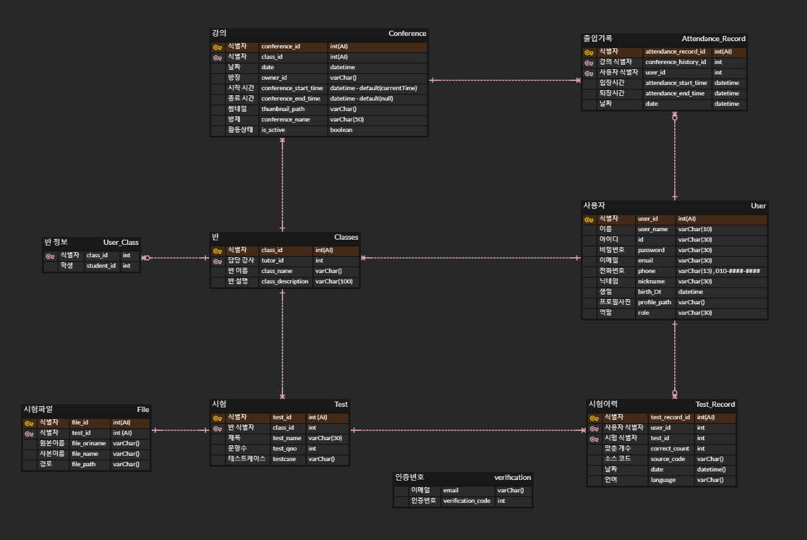

# Coding With Me

## 🗓️프로젝트 개요

- **진행 기간 : 2022.07.08 ~ 2022.08.18 (5주)**
- **목표**
  - 화상 수업, 강사-학생간 코드 전송, 코딩 테스트, 채팅 등 프로그래밍 수업에 필요한 기능들을 한 곳에 모은 프로그래밍 교육 서비스
- **배포 링크**
  - https://3.34.42.81:9000/

## 👯팀원 정보 및 업무 분담 내역

강승길(FE, BE) - webRTC, web compiler 구현, 서버 개발

김동욱(팀장, BE) - ERD 설계, 서버 개발

김혜린(FE) - User & LMS 기능 개발, UI 설계, UI 구현

이성민(BE) - ERD 설계, 서버 개발

최태순(FE) - webRTC, UI 설계, UI 구현

## :paperclip: 발표 자료

https://drive.google.com/file/d/18LT0MX8mZmogb03t9eP4HJiSg1luOV0I/view?usp=sharing

## :information_desk_person: 시연 영상

https://drive.google.com/file/d/1k2rmB0Yzx4SGuA6UBA97MS54xq1HDmev/view?usp=sharing

## :video_camera: 광고 영상

https://drive.google.com/file/d/1-V-glNym-LMATyguBIpyaBFGU1gzE6C-/view?usp=sharing

## :computer: 서비스 내용

### 초기 화면

### 학생 관리

### 시험 생성

### 강의 시작

### code 전송

### 코드 받아보기

### 시험 응시하기

## 기술 스택

1. Sprint/Quasar (Vue) Server: AWS EC2 Ubuntu 20.04 LTS
2. Openvidu Server: Oracle Cloud Ubuntu 20.04 LTS (Openvidu Server의 경우 ARM CPU 사용불가)
3. Compiler Server: Oracle Cloud Ubuntu 20.04 LTS
4. Mysql: 20.04.2
5. Spring Boot: 2.4.5
6. Quasar: 1.0.5
7. Openvidu: 2.22.0
8. Nginx: 1.18.0
9. Node.js: 10.19.0
10. java: 1.8.0
11. gcc: 9.4.0
12. g++: 9.4.0
13. Python: 3.8.10

## ERD

## 기능 정의서/API 명세서/테스트 시나리오

https://docs.google.com/spreadsheets/d/1hJ3F-pyaeCHFWGd1NqcsIKce6SUxkpg3S4VU9M1ses4/edit?usp=sharing

## 🖋️git commit message convention

#### 참고

https://blog.ull.im/engineering/2019/03/10/logs-on-git.html

#### Fix

> 올바르지 않은 동작을 고친 경우

#### Add

> 코드나 테스트, 예제, 문서 등의 추가가 있을 때

#### Remove

> 코드의 삭제가 있을 때

#### Refactor

> 전면 수정이 있을 때

#### Simplify

> 복잡한 코드를 단순화 할 때

#### Improve

> 향상이 있을 때(호환성, 테스트 커버리지, 성능, 접근성...)

#### Make

> 기존 동작의 변경을 명시

#### Implement

> 모듈, 클래스 등 구현체를 완성시켰을 때

#### Correct

> 문법의 오류나 타입의 변경, 이름 변경에 사용

#### Ensure

> 무엇인가 확실하게 보장받도록 할 때

#### Prevent

> 특정한 처리를 못하게 막을 때

#### Avoid

> 특정한 상황을 회피할 때

#### Move

> 코드의 이동이 있을 때

#### Rename

> 이름 변경이 있을 때

#### Allow

> 무언가를 허용할 때

#### Verify

> 검증 코드를 넣을 때

#### Set

> 변수 값을 변경하는 등 작은 수정

#### Pass

> 파라미터를 넘기는 처리를 할 때
